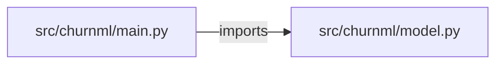

# churn-prediction-platform — project architecture

[README](README.md) · [Interview questions and answers](INTERVIEW_QA.md)

## Purpose and scope

Raw rows → split → train GradientBoosting → metrics → explain. Not a notebook.

This document describes files and symbols in this checkout. Deployment templates and statements in the original overview are distinguished from a verified running environment.

## Component diagram



For Python repositories, arrows show resolved local imports, not network calls or deployment order. Otherwise the diagram is a repository component map; containment arrows do not assert runtime integration.

## Components and responsibilities

| Component | Responsibility |
| --- | --- |
| [`src/churnml/main.py`](src/churnml/main.py) | HTTP handlers: `GET /healthz`, `GET /model`, `POST /score` |
| [`src/churnml/model.py`](src/churnml/model.py) | Functions: `rows`, `trained`, `score` |
| [`requirements.txt`](requirements.txt) | Implementation or supporting configuration |
| [`tests/test_churn.py`](tests/test_churn.py) | Executable checks and regression examples |
| [`.github/workflows/ci.yml`](.github/workflows/ci.yml) | GitHub Actions job definitions |
| [`README.md`](README.md) | Project explanations or operating notes |

## Request interface

| Method and path | Handler | Source |
| --- | --- | --- |
| `GET /healthz` | `healthz` | [`src/churnml/main.py`](src/churnml/main.py#L6) |
| `GET /model` | `model` | [`src/churnml/main.py`](src/churnml/main.py#L10) |
| `POST /score` | `post_score` | [`src/churnml/main.py`](src/churnml/main.py#L15) |

The table lists literal route decorators found in the inspected Python modules. Router prefixes and middleware can add behavior; check the linked handler and application setup before calling an endpoint.

## Implementation walkthrough

### `trained()`

Source: [`src/churnml/model.py`](src/churnml/model.py#L23).

Calls visible in this function: `GradientBoostingClassifier`, `accuracy_score`, `clf.fit`, `clf.predict`, `float`, `lru_cache`, `precision_score`, `recall_score`, `round`, `rows`, `train_test_split`, `zip`.

```python
def trained():
    data = rows()
    X = [[d[f] for f in FEATURES] for d in data]
    y = [d["churned"] for d in data]
    Xtr, Xte, ytr, yte = train_test_split(X, y, test_size=0.25, random_state=7)
    clf = GradientBoostingClassifier(random_state=7)
    clf.fit(Xtr, ytr)
    pred = clf.predict(Xte)
    return {
        "clf": clf,
        "metrics": {
            "accuracy": round(float(accuracy_score(yte, pred)), 4),
            "precision": round(float(precision_score(yte, pred, zero_division=0)), 4),
            "recall": round(float(recall_score(yte, pred, zero_division=0)), 4),
        },
        "importances": {name: round(float(v), 4) for name, v in zip(FEATURES, clf.feature_importances_)},
    }
```

### `rows()`

Source: [`src/churnml/model.py`](src/churnml/model.py#L8).

Calls visible in this function: `data.append`, `enumerate`.

```python
def rows():
    data = []
    for i, (t, c, s, y) in enumerate([
        (1,95,5,1),(2,85,4,1),(3,90,6,1),(4,70,3,1),(5,99,2,1),(6,80,5,1),
        (12,40,0,0),(24,55,0,0),(36,40,0,0),(48,70,1,0),(30,50,2,0),(60,90,0,0),
        (8,88,4,1),(10,75,6,1),(18,45,1,0),(40,85,1,0),(27,35,0,0),(20,95,4,1),
        (50,60,0,0),(7,30,1,0),(15,80,5,1),(22,42,0,0),(9,91,5,1),(33,48,1,0),
    ]):
        data.append({"tenure_months": t, "monthly_charges": c, "support_tickets": s, "churned": y})
    return data
```

### `score(body)`

Source: [`src/churnml/model.py`](src/churnml/model.py#L41).

Calls visible in this function: `InputError`, `body.get`, `float`, `isinstance`, `model['clf'].predict_proba`, `model['importances'].items`, `round`, `sorted`, `trained`.

```python
def score(body):
    for f in FEATURES:
        v = body.get(f)
        if not isinstance(v, (int, float)) or isinstance(v, bool):
            raise InputError(f"{f} must be a number")
    model = trained()
    proba = float(model["clf"].predict_proba([[body[f] for f in FEATURES]])[0][1])
    parts = sorted(({"feature": n, "importance": i} for n, i in model["importances"].items()), key=lambda x: -x["importance"])
    return {"probability": round(proba, 4), "label": "high" if proba >= 0.5 else "low", "factors": parts, "metrics": model["metrics"]}
```

## Validation and failure paths

| Explicit exception | Source |
| --- | --- |
| `HTTPException(422, str(exc))` | [`src/churnml/main.py`](src/churnml/main.py#L19) |
| `InputError(f'{f} must be a number')` | [`src/churnml/model.py`](src/churnml/model.py#L45) |

These are explicit exceptions in the inspected source, rather than a claim that every failure is handled. Follow the calling handler to see whether the exception becomes an HTTP response or propagates.

## Data and state

- [`src/churnml/model.py`](src/churnml/model.py) defines module-level containers: `FEATURES`.

Module-level dictionaries/lists live in a Python process. They can be fixtures or mutable state; inspect writes before treating them as persistent storage. A production extension would need to define persistence and concurrency behavior explicitly.

## Data flow and design decisions

### What is the input-to-output contract of `trained`

In [`src/churnml/model.py`](src/churnml/model.py#L23), `trained()` receives the inputs. The function computes these intermediate values:

- `data = rows()`
- `X = [[d[f] for f in FEATURES] for d in data]`
- `y = [d['churned'] for d in data]`
- `Xtr, Xte, ytr, yte = train_test_split(X, y, test_size=0.25, random_state=7)`
- `clf = GradientBoostingClassifier(random_state=7)`
- `pred = clf.predict(Xte)`

Its result is defined by:

- `{'clf': clf, 'metrics': {'accuracy': round(float(accuracy_score(yte, pred)), 4), 'precision': round(float(precision_score(yte, pred, zero_division=0)), 4), 'recall': round(float(recall_score(yte, pred, zero_division=0)), 4)}, 'importances': {name: round(float(v), 4) for name, v in zip(FEATURES, clf.feature_importances_)}}`

## Setup and verification

The following commands are derived from the checked-in dependency/test contracts. Execute them from the repository root; the block prepares a local environment, not a cloud deployment.

```bash
python3 -m venv .venv
source .venv/bin/activate
python -m pip install -r requirements.txt
python -m pytest -q
```

Python dependencies: [`requirements.txt`](requirements.txt).

Test entry points: [`tests/test_churn.py`](tests/test_churn.py).

Automation definitions: [`.github/workflows/ci.yml`](.github/workflows/ci.yml). Read their triggers and job steps to determine what CI actually runs.

## Operating boundaries and design review

Before turning this checkout into a customer deployment, establish the input contract, data ownership, access controls, failure response, evaluation criteria, and rollback owner. Repository fixtures and unit tests demonstrate local behavior; they do not establish throughput, uptime, compliance, or business impact.

A useful architecture review starts with the linked implementation: identify where input enters, where a decision is made, which state can change, and which external dependency can fail. Add a deployment view only for infrastructure that is actually configured and exercised.
